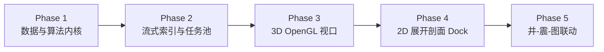

# Paleo Workbench 地震三维体显示与综合剖面开发方案
# (SEISMIC_3D_AND_SECTION_PLAN)

> **文档版本**: V1.0  
> **编制日期**: 2026-09-27  
> **适用范围**: `paleo_workstation` C++ 主程序 / 地震体数据引擎 / 3D与剖面可视化子系统  
> **基线规范**: 遵循 `docs/PALEO_QGIS_PLAN.md`（QGIS 负责 GIS 底座，Paleo 负责地质专业领域）与 `DESIGN.md`（专业浅色设计系统）  
> **技术来源**: 提炼并升级自开源高质量地震渲染原型 `Seismic-Body-Management (SeismicF3Viewer)`

---

## 1. 目标与背景

### 1.1 现状与痛点
在古地理研究与沉积相编图中，“井—震—图”联动是地质解释不可或缺的验证手段：
1. **现状限制**：当前 `paleo_workstation` 的地震支持仅处于初期阶段（`src/io/segyreader.h` 仅支持简单的逐道道头扫描与离散 Inline/Crossline 解码，`SeismicPreviewPanel` 已在 Wave-1 退役），缺乏三维空间直观呈现、任意折线/过井剖面拉切、以及实时性能保障。
2. **海量数据挑战**：实际工区三维地震体（PSDM/PSTM）通常在 10 GB ~ 50 GB 以上（例如实测的 31.2 GB 文件包含近 300 万道）。若在 UI 线程同步解析或采用传统每道离散 I/O，打开将长达数分钟甚至引发内存耗尽。

### 1.2 目标定位
吸收 `Seismic-Body-Management` 原型在 31.2 GB 真实地震工区实测验证过的底层工程资产，在 `paleo_workstation` 中构建**工业级、高性能、无缝融入 Qt6/QGIS 体系**的地震体子系统：
1. **秒级快速首屏**：通过规则探针识别，大文件 0.5 秒内呈现中央切片，后台流式构建索引。
2. **高效大窗口顺序索引与持久化**：全卷道头索引时间从数分钟压缩至十余秒（19 倍加速），并持久化落盘 `.sgyidx` 索引缓存，二次秒开。
3. **三维地震体立体切片视口（3D Seismic Viewport）**：基于 `QOpenGLWidget`，在三维空间中挂载 Inline、Crossline、Time 切片与空间包围盒骨架，支持各向异性缩放与轨道相机交互。
4. **二维任意折线与过井剖面展开（2D Unfolded Section）**：支持用户在地图或 3D 中任意划线/连井拉剖面，基于 `ReadPlan` 物理排序合并读取；在剖面上叠加显示沿线井筒轨迹、测井曲线（GR/DEN）与地质分层（TWT-MD 时深标定）。
5. **“井—震—图”双向空间联动（SeismicMapLink）**：QGIS 地图画布划线直接生成地震剖面；剖面鼠标悬停在地图上投射对应的大地坐标十字准星。

---

## 2. 总体架构与系统分层

严格遵循 `docs/PALEO_QGIS_PLAN.md` 架构契约，严格隔离“纯算法/数据层”与“GUI表现层”：

```
┌────────────────────────────────────────────────────────────────────────┐
│                        Paleo Workbench UI Layer                        │
│  - DataManagementPage: 数据管理页地震 3D 视图与属性控制 Dock           │
│  - Seismic3DViewportWidget: QOpenGLWidget (3D 切片/包围盒/Orbit 相机)  │
│  - SeismicSectionDockWidget: 二维展开剖面、动态刻度标尺、测井/分层叠加 │
└───────────────────────────────────┬────────────────────────────────────┘
                                    │ Qt Signals & Slots
┌───────────────────────────────────▼────────────────────────────────────┐
│                  Linkage & Service Layer (Qt / QGIS)                   │
│  - SeismicMapLink: QgsMapCanvas 折线 ↔ SgyCoordinateMapper 测线映射   │
│  - SeismicTaskBridge: 适配 PaleoTaskService 线程池 (进度/取消/状态机)   │
│  - SelectionContext: 井/层位/测线焦点联动                              │
└───────────────────────────────────┬────────────────────────────────────┘
                                    │ Pure C++20 Contracts
┌───────────────────────────────────▼────────────────────────────────────┐
│             Seismic Domain & Algorithm Core (纯数据/算法)              │
│  - SgyVolume / SgyIndex: 探针规则探测、流式顺序索引构建、.sgyidx 持久化│
│  - SgyCoordinateMapper: CDP-X/Y ↔ Inline/Xline 最小二乘仿射映射        │
│  - ReadPlan & SgySectionBuilder: 磁盘扇区物理排序去重、任意折线提取    │
│  - SgyDataCache: 字节预算受限的 LRU 切片值缓存                         │
│  - SeismicColorMap: 双极性波形振幅色彩映射 (Red-White-Blue) 与重着色   │
└───────────────────────────────────┬────────────────────────────────────┘
                                    │ Low-level I/O & Math
┌───────────────────────────────────▼────────────────────────────────────┐
│                    ThirdParty & Infrastructure Layer                   │
│  - vendor/segyio (C/C++ SEG-Y 底层道头与振幅解析)                      │
│  - vendor/glm (OpenGL 数学库)                                          │
│  - Qt6::OpenGLWidgets / QOpenGLFunctions_3_3_Core                      │
└────────────────────────────────────────────────────────────────────────┘
```

---

## 3. 核心数据模型与算法设计 (Domain Core)

### 3.1 极速探针与流式顺序索引（`SgyVolume` & `SgyIndex`）
- **规则布局探针（Rule-based Probe）**：
  在打开 SEG-Y 文件后，优先对文件头及 24 个离散测线位置进行微秒级探针嗅探。若满足规整矩形网格且步长一致（如 Inline Step=2, Xline Step=1），则立即激活公式寻址，在 **0.5 秒内**提交首张中央切片，用户无需等待全卷道头遍历。
- **大窗口顺序扫描（Sequential Scan Indexing）**：
  若需建立全卷完整索引，严禁使用传统的逐道随机定位（298 万次小 I/O）；采用按磁盘物理扇区顺序的 **64KB~2MB 大块连续扫描**，批量解码道头，将 31.2 GB 索引时间从 260 秒压至 13.6 秒。
- **持久化索引缓存（`.sgyidx`）**：
  索引构建完毕后，以原子写入方式生成同名 `<filename>.sgyidx` 二进制缓存。记录文件大小、修改时间、四角大地坐标、Inline/Xline 极值映射表与 CRC 校验。二次打开直接 mmap/反序列化载入（耗时 < 300ms）。

### 3.2 大地坐标与工区测线仿射映射（`SgyCoordinateMapper`）
- 依据 SEG-Y 道头中记录的真实大地坐标（CDP-X / CDP-Y，字节 181-188）与测线号（Inline, Xline），构建双向仿射拟合：
  $$\begin{cases} X = a \cdot \text{Inline} + b \cdot \text{Xline} + c \\ Y = d \cdot \text{Inline} + e \cdot \text{Xline} + f \end{cases}$$
- **残差守卫（Residual Guard）**：计算拟合的均方根残差（RMS Residual）。若残差超过阈值（如 25 米），拒绝伪造坐标，明确报错以防引入错误地理拓扑。
- **作用**：打通 QGIS 画布 CRS（如 WGS84 / UTM / 高斯克吕格）与地震体工区测线号，为“地图划线拉剖面”和“剖面十字光标返投地图”提供数学基础。

### 3.3 读计划优化与折线剖面提取（`ReadPlan` & `SgySectionBuilder`）
- **任意折线与过井路径**：输入为一系列大地坐标折线点或工区内的井位序列，自动插值并离散为目标道列表。
- **读计划优化器（ReadPlan）**：
  1. **空间去重**：合并连续重复采样的地震道；
  2. **物理排序**：将目标道按文件物理偏移单调递增排序；
  3. **相邻区间合并（Range Coalescing）**：相邻距离小于阈值的道合并为单次连续读，避免磁头/SSD 频繁寻道；
  4. **两阶段渐进式返回（Progressive Slicing）**：先返回 256 列粗切片即时上屏，后台线程异步提取 2048 列全分辨率切片并平滑过渡替换。

### 3.4 双极性振幅色标与动态重着色（`SeismicColorMap`）
- **色彩策略**：
  - 正振幅（波峰 Peak）：鲜红渐变；
  - 负振幅（波谷 Trough）：深蓝渐变；
  - 零振幅（Zero-crossing）：纯白过渡；
  - 无效值/未采样点（NaN）：深灰（RGB: 48, 49, 49），杜绝“将无数据误作零振幅”的伪地质现象。
- **动态范围重着色（Recolorize）**：
  提供对数/幂律对比度参数（$\text{contrast}=1.45, \gamma=0.82$）。用户在界面拖动增益/对比度滑块时，仅触发 CPU 内存 RGBA 数组重映射与 GPU 纹理更新，**严禁重新读取底层 SEG-Y 文件**。

---

## 4. 渲染管线与 Qt 视口集成 (Rendering & UI)

### 4.1 3D 地震体视口（`Seismic3DViewportWidget`）
- **类定义**：继承 `QOpenGLWidget`，并实现 `QOpenGLFunctions_3_3_Core`。
- **三维渲染实体**：
  1. `SeismicSliceRenderer`：维护 4 个渲染槽（Slot 0: Inline, Slot 1: Xline, Slot 2: Time, Slot 3: Arbitrary Polyline Ribbon Curtain）。动态生成 3D Quad 网格，绑定 2D RGBA 纹理，挂载于三维空间实际剖面位置。
  2. `VolumeFrameRenderer`：绘制地震工区 12 条边界框架线与当前活动剖面的黄色高亮路径，在空间中投射三维十字标。
  3. `HorizonRenderer`：可选叠加地质层位三角网格（高程色谱或线框叠加）。
- **交互控制器（Orbit Camera）**：
  - 鼠标左键拖拽：围绕工区中心旋转；
  - 鼠标中键/右键拖拽：平移相机；
  - 鼠标滚轮：连续平滑缩放；
  - 提供快捷键与工具栏：顶视（Top）、侧视（Side）、等轴测（Isometric）、复位居中（`FitToBounds`）。

### 4.2 二维专业展开剖面组件（`SeismicSectionDockWidget`）
- **设计规范一致性**：完全按照 `DESIGN.md` 构建，浅色专业界面质感，背景采用中性底色（`surface-alt: #EDF1F5` / `surface: #FFFFFF`），文字与边框采用规范 Token。
- **核心能力**：
  1. **双轴动态标尺（`NiceStep` 算法）**：横轴显示沿折线展开的累积距离与测线编号，纵轴显示双程旅行时（TWT ms）或采样深度；刻度随着视口缩放自动调整密度。
  2. **无级平移与缩放**：支持 0.12x ~ 64x 缩放与双向平移。
  3. **测井轨迹与曲线叠加（Well Log Overlay）**：自动搜索剖面缓冲区（如 200 米）内的穿过井，在剖面上绘制垂直井筒，并在井侧绘制伽马（GR）、密度（DEN）曲线。
  4. **时深转换与地质分层（TWT-MD Calibration）**：利用工区时深关系表进行线性插值，将测井的分层深度（MD）准确标定在地震反射同相轴上。

### 4.3 “井—震—图”联动服务（`SeismicMapLink`）
- **地图 → 剖面**：
  用户在 QGIS 地图画布（`QgsMapCanvas`）使用“剖面拾取工具”画一条折线。
  `SeismicMapLink` 捕获该几何对象（`QgsGeometry`），调用 `SgyCoordinateMapper` 转换大地坐标为工区测线号，通知后台任务调度器异步抽取该折线剖面，完成后在剖面视口自动展开展现。
- **剖面 → 地图**：
  鼠标在地震剖面上滑动或点击时，反向解算出当前点的大地坐标 $(X, Y)$，通过 `SelectionContext` 在 QGIS 地图画布上绘制瞬态高亮十字光标或投影点，实现实时的跨视图时空追踪。

---

## 5. 分阶段实施路线（Phased Plan）

按照增量演进、每阶段可独立编译并通过测试的原则拆分为 5 个阶段：



### Phase 1：第三方集成与纯数据内核移植（约 1~2 天）
- **任务目标**：
  1. 引入 `vendor/segyio` 与 `vendor/glm`（头文件/轻量库）；
  2. 在 `src/domain/seismic/` 中植入无界面的核心算法：`SgyFileReader`, `SgyVolume`, `SgyIndex`, `SgyCoordinateMapper`, `ReadPlan`, `SgySectionBuilder`, `SeismicColorMap`；
  3. 将原有仅读简单道头的 `src/io/segyreader.h` 替换/平滑升级为新核心。
- **验收标准**：
  - 编写并运行 `tests/tst_seismic_core`，对现有 fixture SEG-Y 文件进行单元测试；
  - 验证规则探针识别正确、仿射坐标拟合残差在预期内、任意剖面抽取数据一致。

### Phase 2：任务池接入、大窗口索引与持久化缓存（约 1 天）
- **任务目标**：
  1. 将全卷扫描与切片提取接入 `PaleoTaskService` 异步任务框架，杜绝 UI 线程阻塞；
  2. 实现 `.sgyidx` 索引文件的序列化、校验与反序列化，支持断点与版本失效安全回退；
  3. 实现内存切片 LRU 缓存（`SgyDataCache`）。
- **验收标准**：
  - 运行 `tests/tst_seismic_index`；
  - 验证大文件首次加载自动产出 `.sgyidx`，二次加载耗时降低 90% 以上；
  - 测试取消操作（CancelToken）可在 50ms 内响应并中止。

### Phase 3：3D 地震体预览视口（`QOpenGLWidget`）（约 1.5 天）
- **任务目标**：
  1. 将 GLSL 着色器打包进 `resources/shaders/seismic/`；
  2. 实现 `SeismicSliceRenderer` 与 `VolumeFrameRenderer`，在 `Seismic3DViewportWidget` 中完成渲染生命周期对接；
  3. 接入 Arcball 相机与各向异性缩放比控制，嵌入数据管理页右侧预览面板。
- **验收标准**：
  - 能够实时拖动 Inline / Crossline 滑块，以 60 FPS 顺畅更新 3D 空间切片；
  - 支持边界线框显示、视角一键切换（Top/Side/Iso）与居中复位。

### Phase 4：二维任意折线与过井剖面 Dock（约 1.5~2 天）
- **任务目标**：
  1. 构建 `SeismicSectionDockWidget`，实现基于 `QPainter` / OpenGL 的高质量二维剖面呈现；
  2. 接入 `NiceStep` 动态刻度标尺、无级缩放平移交互；
  3. 叠加沿线井位轨迹柱状线、时深插值、测井曲线（GR/DEN）与地质分层标线。
- **验收标准**：
  - 任意多段折线输入能秒级展开为二维剖面；
  - 井筒位置与测井曲线精确对齐同相轴；界面视觉风格严格匹配 `DESIGN.md`。

### Phase 5：QGIS 画布与地震联动（`SeismicMapLink`）（约 1 天）
- **任务目标**：
  1. 在 QGIS 画布上增加“地震测线拾取”交互工具；
  2. 打通 `QgsMapCanvas` ↔ `SelectionContext` ↔ `SeismicSectionDockWidget`；
  3. 实现地图画线即时出剖面、剖面鼠标悬停在地图上同名点投射十字光标。
- **验收标准**：
  - 双向联动测试通过，坐标映射误差小于半个道间距；无乒乓事件风暴。

---

## 6. 风险与防御对策

| 潜在风险 | 影响程度 | 防御措施与设计对策 |
| :--- | :--- | :--- |
| **SEG-Y 道头非标准 / 坐标字段异常** | 中 | `SgyCoordinateMapper` 严格实施 RMS 残差检验。若残差超标或字段全零，在状态栏如实警告“道头未携带有效投影坐标”，回退到纯测线号索引，不乱吸附。 |
| **数十 GB 文件引发显存/内存溢出** | 高 | 实行严格的切片级有界 LRU 缓存预算；全分辨率切片仅按需异步提取并做纹理复用（`glTexSubImage2D`）；3D 视口中同一槽位仅常驻单张纹理。 |
| **QOpenGLWidget 与 QGIS Canvas 渲染冲突** | 中 | 采用独立的 FBO/OpenGL 上下文隔离，不与 QGIS 2D 画布共享未受管的着色器状态；遵循 Qt 的 `initializeGL` / `paintGL` 状态保护惯例。 |
| **多平台与工具链兼容性** | 低 | 核心层使用标准 C++20，依赖库均为纯源码或标准 POSIX/Win32 API，屏蔽平台特定非标扩展。 |

---

## 7. 审批与交付结论

本方案完全继承了外部仓库 `Seismic-Body-Management` 的全部优秀算法资产（流式顺序大窗口索引、规则探针秒级首屏、物理扇区读合并、大地坐标仿射拟合、四槽三维切片模型），并彻底淘汰了其与本项目冲突的 GLFW/ImGui 架构，重构为符合 `paleo_workstation` 设计系统（`DESIGN.md`）和权威规划（`PALEO_QGIS_PLAN.md`）的 Qt6 / QGIS 原生专业地质组件。

~~请用户评审并批准本方案。批准后，我们将按 **Phase 1 → Phase 5** 的顺序稳步落地执行。~~

**交付状态（2026-09-28）**：Phase 1–5 已落地并经 `feature/seismic-3d-section` 并入 `master`
（含 `a6b5b0f` 时间片剖面+3D 视口入主窗、`c5532cf` GL 上下文 profile/shader 资源/任务服务修复、
`085e88e` 时间片网格缓存+相色预览+剖面色标）。相关测试：`tst_seismic_core`/`tst_seismic_3d`/
`tst_seismic_section`/`tst_segy_*`/`tst_datapreview`/`tst_linkage`/`tst_threeway` 全绿。

**引擎 vendor 化（2026-09-28）**：上游仓库 `changyanyanchang/Seismic-Body-Management` 的 `Data/Sgy`+`Engine`
（含 `sdk::Dataset`/`SdkC` 稳定 facade、workspace/paged 后端、LOD、TranscodeJob）以 `vendor/sbm` 原样入库，
pinned `aae56c77f8233e206523717ad8fdd854b3a5156e`。`domain/seismic` 原移植层退役为转发头；项目增强
（`TimeGridCache`+mmap 并行 `ReadSlice`、`.sgyidx` 伴生缓存）以 vendor 补丁保留（见 `vendor/sbm/PATCHES.md`）。
切片提取已走 `sdk::Dataset`；转码/QuickOpen/LOD/ReadSection 等高价值入口登记 TODOS 待接线。
