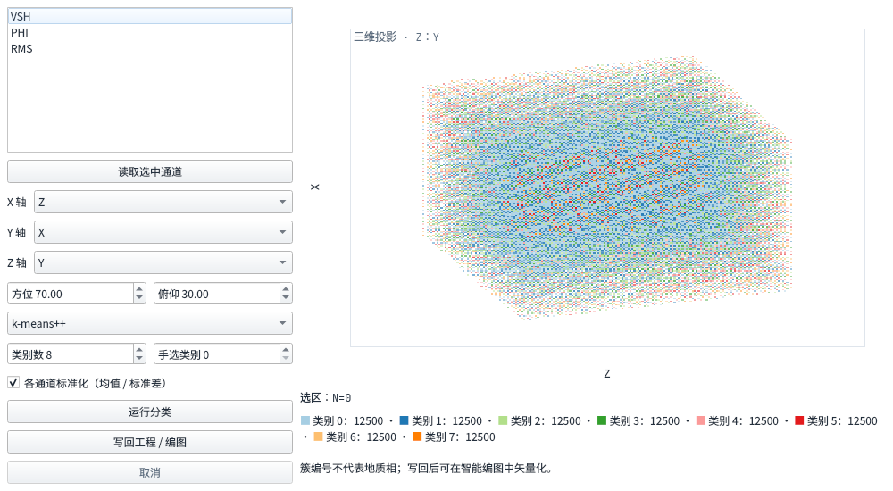

# 交会分析与无监督相分类

日期：2026-10-02；Goal-Loop 方向 14。逐轮提交与验收命令见
[`../../.goal-loop-ledger-crossplot-facies.md`](../../.goal-loop-ledger-crossplot-facies.md)。

## 入口与操作

打开底部「交会相分类」页签，或按 `Ctrl+Alt+X` 展开它。工程 catalog
中的井曲线（包括 petrophys 派生 LAS）、GeoTIFF 和 SATR 列在通道表。
多选通道后读取样本：井曲线须来自同一口井；SATR 须配时间层位（ms）。

X/Y 可换任意已读取的通道；Z 选择通道后为三维正交投影，方位/俯仰可调。
≥100k 样本自动使用 256² 密度格，原始点索引仍保留用于拾取和选区。
拖动为套索，Shift 拖动为框选；统计显示 N、各通道均值和有效样本占比。
点击点定位井/像元，选区联动井选择、源图层树和地图点高亮。
井点缩放到周边 1km 窗口，栅格点缩放到周边 16 像元窗口；中心和窗口角点
一起转到画布 CRS，避免把米制跨度直接套到经纬度坐标。

选择 k-means++ 或 GMM、类别数并运行。默认逐通道 z-score，常量通道
标准差记为 1。手选凸包/多维盒规则使用当前选区并写入指定类别；已有分类
在选区外保留。簇编号尚无地质解释，必须由解释者判断、映射为相。

「写回工程 / 编图」经项目单写队列生成受管 DERIVED 资产：

- 栅格：Byte GeoTIFF、palette，0–254 为类别、255 为 nodata；缺失、未分类
  和剖面未覆盖像元保留 nodata。父版本、SHA-256、参数 hash 和采样语义记入
  catalog；GeoTIFF 同时携带 `PALEO_CLASSIFICATION` JSON。
- 井点：`well_facies_intervals` JSON，关联井的 `interpretation` 角色。
  同类连续观察行压为层段；NaN 缺失行、类别变化或井变化断段。
  top/base 是观察深度的包含端点，单点段 top=base，未推断支持厚度。
  `FaciesClassificationService::intervals` 返回数据层 DTO，供相统计消费。

栅格声明为 `predict.<horizon>.crossplot`，出现在现有编图页相栅格下拉项，
通过已有 `CompositionWorkflow::deriveFaciesPolygons` 矢量化为先验相图/约束
图层。编图内部和 mapbook 批量链路均沿用原实现。



图为 UI 绘制夹具（轮换类别色），用于核验密度云、轴控件与完整图例布局。

## 分层与数据契约

| 层 | 实现 | 职责 |
|---|---|---|
| 数据 | `domain/crossplotsamples.h`、`faciesclassification.h` | 行主序 SampleSet、位置、参照网格、分类/井段 DTO |
| 数据 | `algorithms/cluster` | 纯 STL 数值核，无 Qt/ML 库 |
| 数据 | `services/crossplotsamples`、`crossplotsources` | LAS/GDAL/SATR 抽样、投影、密度、选区统计、点拾取 |
| 数据 | `services/faciesclassificationservice` | 标准化、规则、置信度、provenance、文件编码 |
| 功能 | `workflow/faciesclassify` | 任务池、取消/进度、单写队列、DERIVED 登记 |
| QGIS 封装 | `qgis/crossplotmaplink` | CRS 转换、定位、精确样本点高亮 |
| 视图 | `ui/crossplot` | 画散点/密度云、显示服务返回结果、发意图 |
| 组装根 | `app/crossplotcontroller` | 工程与通道、面板、工作流、地图/树联动 |

统一 SampleSet 保留维名/单位、有限多维值、井深或像元位置、原始行号、
父版本、源图层和采样 metadata。读入替换先清旧样本和分类；失败/取消不会
把旧成果显示成新输入的成果。任务世代守卫阻止切工程/重读后的迟到结果回填。

### 井曲线

`well(QVector<Channel>, Control)` 使用第一通道的严格递增有限深度网格；
其它通道精确匹配或邻点线性插值，不外推、不跨 NaN。所有维度联合有限才
入样本。`las(path, names, location, version, Control)` 和 catalog loader
均复用 LasCache，可跨同井不同原始/派生 LAS 深度对齐。无序深度如实拒绝。

### 栅格 / 属性平面

`rasters(QVector<RasterSource>, Control)` 以第一张为参照，用完整六参数仿射
取像元中心，经 OGR CRS 转换后取源包含像元，GDAL 64 行块读取 nodata/mask。
已知/未知 CRS 不能混采。`planes(QVector<Plane>, Control)` 接已同网格的
任意维数属性平面；≥3 维直接投喂聚类，无需降为画图的 X/Y 维。

### SATR × 时间层位

`attributeSection` 验证 SATR 魔数、版本、尺寸、JSON 和 float 载荷，使用
源 SEG-Y 测网轴值表、采样间隔和起始时刻；row 0 是最深时间行。
`attributeHorizon(sections, horizons, Control)` 先以道 XY 找层位像元，
用第一时间层位 TWT 取最近属性时间样本，不外推；其它所选层位值也是特征。
缺失时间/属性联合剔除。粗层位像元内多条有效道聚合为一个逐维均值向量，
确保分类回写每像元唯一，定位使用参照像元中心。metadata 记录有效道数、
唯一像元数、合并道数、各属性时间轴和测网拟合残差。

SEG-Y 没有显式投影基准，因此当前只允许同一局部工程坐标系或无 CRS 的
时间层位；普通栅格/深度层位不能冒充 ms。既有测网仿射拟合有精度阈值，
合成夹具出现 y 残差 −2m，按既有 25m 门核验并记 provenance；不声称
坐标为无误差真值。SATR 剖面只回写被道覆盖的参照像元，不虚构全体覆盖。

## 聚类选型与置信度

- **k-means++ / Lloyd**：平方距离加权播种，确定 seed（默认 42），低内存、
  线性迭代代价，适合快速多维探索。不同值不足 k 时报告实际 k；k=1 精确
  退化为全局均值。空集在数值核返回成功空模型，工作流拒绝生成空成果。
  选型参考 [Arthur & Vassilvitskii, 2007](https://theory.stanford.edu/~sergei/papers/kMeansPP-soda.pdf)。
- **对角 GMM / EM**：各维方差、log-sum-exp 后验、方差下限 1e−6，
  k-means 初始化；内存主要是 N×k responsibilities。EM 似然下降超过数值
  容差时失败，不接受坏模型。对角起步避免全协方差矩阵病态和高维平方成本。
  参考 [Dempster, Laird & Rubin, 1977](https://rss.onlinelibrary.wiley.com/doi/abs/10.1111/j.2517-6161.1977.tb01600.x)。
- **模型比较**：固定维数 d、有效类数 k，BIC 参数数 `2kd+k−1`，
  `BIC=(2kd+k−1)ln(N)−2LL`，越低越好；不自动挑 k。
  参考 [Schwarz, 1978](https://projecteuclid.org/journals/annals-of-statistics/volume-6/issue-2/Estimating-the-Dimension-of-a-Model/10.1214/aos/1176344136.full)。
- **手选规则**：套索统计保留原顶点顺序，以偶奇法包含边界；凸包分类器
  明确取顶点凸包，凹区的凹口会被填平。多维盒从套索内样本取得所有特征的
  lo/hi，而非只限制显示的 X/Y。规则及轴/方位/俯仰均写入 provenance。

| 输出 | 口径 |
|---|---|
| k-means confidence | `1−d1²/d2²` 相对分离度，非地质正确概率；k=1 为 1、并列零距为 0 |
| GMM confidence | 获胜分量最大后验概率，非地质正确概率 |
| squaredDistance | 当前输入空间（默认标准化）的到获胜中心平方欧氏距 |
| 手选 confidence | 覆盖点为规则成员 1、未分类为 0；选区外继承旧分类数值和口径 |
| 手选 squaredDistance | 覆盖点置 0（规则成员，不代表到中心距离），选区外继承 |

置信度/距离向量由分类服务返回，井段写平均置信度；分类 GeoTIFF 当前只持久化
类别与模型 provenance，未把置信度冒充现有 ONNX 伴生通道。手选叠加记录
前一分类 provenance 和输入标签 hash，保证来源可追溯。

## Oracle 与可重放命令

构建：主仓 vendored QGIS prefix，RelWithDebInfo，GCC，`-j4`。配置：

```sh
cmake -S . -B build -G Ninja -DCMAKE_BUILD_TYPE=RelWithDebInfo \
  -DQGIS_PREFIX=/home/kevin/projects/paleo_workstation/vendor/superbuild/prefix
cmake --build build -j4
PALEO_REAL_PROJECT_AREA=/home/kevin/projects/paleo_project/data/project_area \
  PALEO_CROSSPLOT_SCREENSHOT=/tmp/crossplot-panel.png \
  ctest --test-dir build -R '^tst_(cluster|crossplot.*|faciesclassify)$' -V
PALEO_REAL_PROJECT_AREA=/home/kevin/projects/paleo_project/data/project_area \
  ctest --test-dir build --output-on-failure
python3 tools/check_layering.py --strict
python3 tools/check_i18n.py
python3 tools/check_ui_invariants.py --strict
python3 tools/check_tidy.py --build-dir build
git diff --check
git diff origin/master...HEAD
```

| Oracle | 断言与证据 |
|---|---|
| 1 数值核 | `tst_cluster`：双峰中心误差 <5%、纯度 >.95、k=1 均值；空/单点/全同值；两高斯均值与权重误差 <10%、EM LL 非降、BIC 解析式/优于 k=1；内/外/边界/凹 lasso/凸包/盒 |
| 2 三路采样 | `tst_crossplot_samples`：深度插值与 NaN；12 像元剔 2 → 10；三维输入；属性×层位 4 道剔 1 → 3、值 0/11/22；真实 SATR 格式+源测网读取值 20/11/2；粗像元合并均值 |
| 3 UI | `tst_crossplotpanel`：轴意图、实际点点击/Shift 框选、N/均值/占比；100k 密度总数；2D/3D 投影重绘。`tst_crossplot_controller`：真实壳读源→轴换→任务→写回、地图/树联动、坏源清除 |
| 4 回写 | `tst_faciesclassify`：15 有效+1 nodata、逐像元类别计数/palette、DERIVED/hash/父版本、catalog 重开、只读拒写、统计篡改拒写；井段 0–1 / 3–3 / 4–4 不跨 NaN |
| 5 编图 | `tst_faciesclassify` 调已有 deriveFaciesPolygons 成功；`tst_crossplot_controller` 断言编图下拉有 predict.D53.crossplot |
| 6 性能/任务 | `tst_crossplot_perf`：100k k8、1M 分类+实际 TIFF 落盘、10×样本比率 <25；数值/采样/workflow 协作取消、单调进度、失败不伪报成果 |
| 7 记账 | 本文与 ledger，每轮独立提交；全量审查与门禁实测在 ledger 轮5 |

真工区门控 `PALEO_REAL_PROJECT_AREA` 已实际设置。D53/D61/D62 三维交会
263446 有效像元、5 个联合缺失，独立 GDAL 三栅格 mask/finite/nodata 交集计数
逐项对拍。A1 LAS 两曲线 15272 有效、309 剔除。真数据只读，写入临时目录。

2026-10-02 最终代码的专项 Oracle：6/6 PASS（4.97s）。绝对耗时为独占
测试进程下实测，非跨机器承诺。

| 测量 | 本机实测 | 目标/门 |
|---|---:|---:|
| 100k 2D 密度投影+绘制 | 5.313ms | <200ms 感知 |
| 100k 3D 轴切换+绘制 | 13.805ms | <200ms 感知 |
| 100k k-means k8 | 14.819ms | <3s |
| 1M 分类+TIFF 写入 | 135.627 + 16.114 ≈ 151.742ms | <10s |
| 10×样本聚类耗时比 | 9.152 | <25 |
| 真工区三栅格采样 / k8 | 17.254 / 442.925ms | 记录实测 |
| 全量 ctest（真工区门控开启） | 176/176 PASS，529.01s | 全绿 |

跨机器不以此处绝对毫秒作回归门，仓库比率门照常执行。

### 全量门禁修复记录

首轮带真工区环境的全量测试发现三个既有失败；在主 checkout 的
`11099e2` 构建上对照运行同样 3/3 失败。导入夹具现在只扫描原始交付目录，
避免源工程受管副本的哈希文件名先于命名层位去重；旧文件数断言排除地震体旁
的 `project.paleo` 工程束，参考附件数按实际目录核验，核心井/层位/测网数仍精确断言。

mapbook 实测范围为 `(0, NaN, 1000, NaN)`。因初始禁区，先请求用户明确例外，
获得「允许这项最小布局修复」后，仅将地图范围初始化移到尺寸设置之后，并用
QGIS `zoomToExtent` 保证整块范围可见。tile/montage 同类位置均加有限范围/
完整覆盖断言；取消按钮测试按空闲禁用、忙态发信号核验。批量队列与编排未改。
全仓 UI 门禁另发现既有测井面板裸 QSS 色值，已换为主题 token。

最终代码完整回归 176/176 通过。此前一次完整回归的面板模态输入与启动占比
测试发生波动，独立复验 2/2 通过，随后最终完整回归亦通过；未调比率阈值或
放宽这些测试的断言。详细命令、日志位置与输出摘要见 ledger。

## 递延

有监督样本标注/训练/推理与 RemotePredictionRouter 深化另立项；SOM、全协方差
GMM、时深域跨源交会（单位/基准/模型不确定性）、4D/时移、打印导出排版。
大维数/大 k 的 GMM N×k 缓冲可按工区规模改分块 EM；分类置信度伴生栅格和
地质相代码命名表可按业务消费需要接入。当前簇 palette 是数据符号色，UI
字体、chrome、焦点和间距遵循 DESIGN.md。
