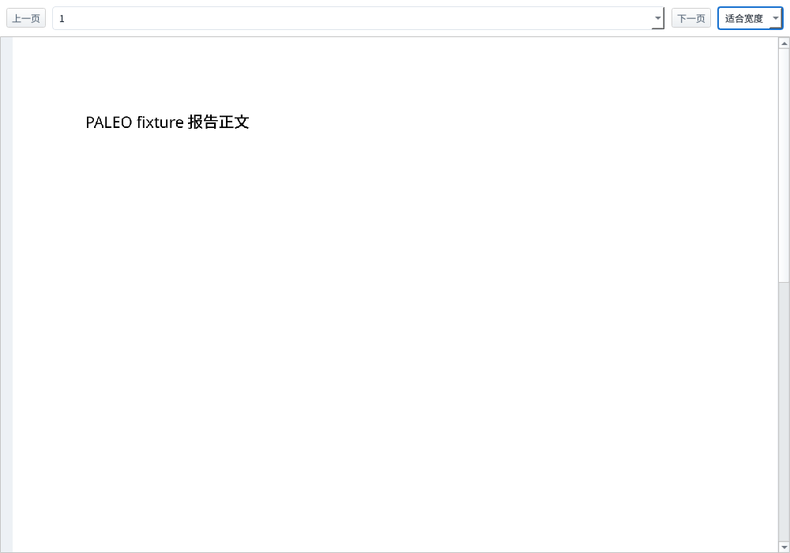

# Office 离线预览与后台工程数据加载（2026-10-09）

用户排除 LibreOffice，随后要求原件能编辑，而不是只看页面图。
Office 原件改为本机 ranuts/document 编辑页（OnlyOffice WASM，无文档服务器）。
后台工程与地震数据加载、辅助 XML 双视图继续保留。不转 PDF。保存另登记 DERIVED 版本。

## 2026-10-09 跟进：ranuts/document 编辑页

- 六种原件仍由 `OfficePreviewWidget` 打开。功能层 `OfficePreviewSession` 只监听
  `127.0.0.1`，托管 `vendor/ranuts-document/` 里的静态编辑页，并给出当前原件的一次性地址。
- 视图沿用 `WebViewPanel`。无 WebEngine 或无屏时显示原因，并用系统浏览器打开同一地址。
- 页内宿主把编辑器以 `embed=1` 放进 iframe，用 `document:open-url` 打开原件。
  `document:saved` 把字节 POST 回本机；会话写入临时文件后，预览标签把它登记为同一资产的
  DERIVED 版本，父版本是打开时的 RAW。原件字节不改。
- 关闭标签或再次打开会停掉监听，旧地址失效。路径段里的 `..` 不映射到编辑器目录之外。
- 安装：`vendor/fetch-ranuts-document.sh`。覆盖目录用 `PALEO_OFFICE_EDITOR`。
- 协议是 AGPL-3.0。编辑器头部的 ONLYOFFICE 标识保留。静态树不入库。
- 下方 Calligra 页图记录是同一天更早的实现，预览链已经不再调用它。

## 原件预览

- DOC、DOCX、XLS、XLSX、PPT、PPTX 统一使用 `OfficePreviewWidget`，默认版本
  锚回 RAW 原件。预览不调用历史 PDF/XLSX 转换 API，不登记派生 Office 版本。
- Calligra 26.08.2 是 2026-10-08 发布的稳定版；2024 年 4.0 文章仅是 Qt6 迁移
  说明。见 [KDE 发布记录](https://kde.org/info/releases-26.08.2/) 和
  [官方应用版本列表](https://apps.kde.org/en-gb/calligra.words/)。源码包、提交与
  SHA256 固定在 `vendor/manifest.json`。
- `vendor/fetch-calligra.sh` 源码构建 Words / Sheets / Stage 和六个 Microsoft
  导入滤镜，并包含图片、矢量、图表与公式 shape。ECM、Boost、Eigen、KDiagram
  同样固定哈希；Qt/KF6 优先显式前缀，当前使用本机 ABI 一致的开发包作为兜底。
- Calligra 的 Qt GUI 文档引擎仅进入 `src/app/officepreviewrenderer.cpp` 独立进程，
  功能层异步管理进程、外链 SHA 校验与页面图像解码；视图仅接收结果并发出切页
  请求。无 `QWindow::fromWinId` 或平台窗口扫描依赖，也无 LibreOffice 回退路径。
- 解析原件后返回页码/工作表目录，按需生成当前页 PNG。Qt 原生控件提供上一页、
  下一页、页码/工作表、适合宽度、缩放和双向滚动。当前仅保留一份解码页面，
  快速切页合并请求；关闭标签立即异步终止自己的进程，临时配置及导入中间文件
  在进程退出后回收。
- 显式指定 Microsoft 标准 MIME，避免 WPS 等桌面软件注册私有 MIME 后使
  OOXML 滤镜无法选择。Word 在加载前建立 canvas 与 shape 事件接线，加载后
  刷新空间索引，再等文本根区域全部排版完成后直接绘制；避免 thumbnail 的等待
  接口再次改动排版。并发打开和反复切回同页使用像素一致性回归，防止第一页空白。
- 两份可复现的 XLSX 上游补丁见 `vendor/patches/README-calligra.md`：缺少可选
  样式表时不解引用空默认样式，内联字符串保留文本及既有单元格格式。
- 页面上限 4,000、最长边 2,200 px；超过限制、加密/损坏、组件缺失或超时明确报错。
  文档样式由 Calligra 导入兼容性决定，复杂排版/公式/动画仍需真实资料验收。
- PDF 原件及用户明确选择的既有 PDF 历史版本继续使用 QtPdf。旧转换 API 仅为
  兼容显式调用保留；LibreOffice 已从 Office 预览链排除。
- 当前 Linux 编译及实测；Qt 页面宿主无需 xcb 专用窗口接管，Wayland 宿主不再
  存在外部窗口嵌入限制。Windows/macOS 的依赖打包和运行仍待实机验证。

## 后台数据准备

- 沿用 QGIS 独立后台 `QgsProject` 读取器，新增后台准备钩子；目录库完整性检查、
  迁移、备份读取、索引、序号扫描、井轨迹文件解析及模型注册表扫描进入该阶段。
- `DataCatalog::prepareOpen` 在创建线程关闭 SQLite 连接，移交已解析的表和索引；
  `adoptPrepared` 在 GUI 线程保留原 catalog 对象及信号连接，只恢复本线程连接，
  复核目录库 revision，不重新读取整库。发生变更时拒绝使用过期快照及写入。
- `ProjectDataFacade` 共享已加载的 catalog，消除第二遍目录库读取。SHA 缓存首次
  使用才加载磁盘文件。新工程的崩溃 staging 清理由后台准备阶段完成。
- `ProjectLayerRefreshWorkflow` 对导入通知合并调度；后台处理 catalog 快照并生成
  井点与井轨迹 GeoJSON。按工程、世代和 mutation sequence 丢弃过期结果，切换
  或关闭工程时取消接管。后台只写临时产物，最终原子发布在当前工程锁保护下完成。
- QWidget、打印布局和 QGIS 图层最终接管、渲染刷新保留在 GUI 线程。工程打开
  期间有进度提示；取消立即返回界面，后台读写结束前仍保留工程锁。

## 验证

初期后台目录与导入改动构建 `paleo` 及相关测试目标，资源上限 `-j8`。
该阶段以下 **14/14 套件通过**：

```bash
ctest --test-dir build -j4 --output-on-failure -R '^(tst_background_open|tst_officepreview|tst_datapreview|tst_projectsvc|tst_catalog|tst_import|tst_folderimport|tst_shell_projectlifecycle|tst_cache_io|tst_previewdoc|tst_projectdata|layering|layering_strict|layering_selftest)$'
```

历史 LibreOffice 窗口测试已由 Calligra 页面测试替换。有效六格式 fixture 保存在
`tests/fixtures/office/`。最新渲染测试覆盖真实页面非空、工作表切换、GUI 心跳、
SHA 不变、缺失组件/坏文件、校验失败与关闭取消。独立运行时隔离用户配置：

```bash
QT_QPA_PLATFORM=offscreen XDG_CONFIG_HOME=/tmp/paleo-office-test-config \
  XDG_DATA_HOME=/tmp/paleo-office-test-data build/tst_officepreview
```

后台测试覆盖只读准备不造库、接管后保存、磁盘 revision 改变拒写、导入快照合并、
取消结果丢弃、关闭期间保留写锁到后台退出。`check_layering.py --strict`、
`check_ui_invariants.py --strict` 与 `git diff --check` 通过。

导入回归中的井口改型 fixture 改为无表头固定列数据，保留「自动分类未知、用户再
改型为井口」的测试触发条件；原有含 `#Name X Y` 的 fixture 已会被分类器识别。

## 2026-10-09 跟进：接管后停顿与辅助 XML

- 地震体本身已由任务池读取，但体就绪后的候选井预览仍同步读取 LAS、轨迹与
  时深表。`SectionWorkbench::requestPreviewData` 改为对目录快照后台解析；按
  工程路径、世代与 mutation sequence 检查结果，重复请求合并，关闭或切换
  工程取消后续接管。测试用 740,000 行 LAS 验证提交耗时与 GUI 心跳。
- 实际工程副本还暴露了 GUI 上连续恢复设置、接管图层、装配面板的长回调。
  `QgisProjectService` 将接管拆成独立事件；底图、测区、井位与井轨迹分拍恢复。
  GUI 接管期间防止编辑中间状态，完成后恢复操作；地震体任务在接管完成后启动。
  各步骤按世代/工程会话复核，关闭后不会继续装配；接管期间拒绝保存半成品。
  自动地震体加载使用已有状态栏进度，避免任务底栏在载入和完成时反复展开、
  收起；隐藏任务面板不重建任务行，可见面板对密集通知每帧合并一次。
- 多口井解析同时完成时，连续更新曲线界面仍会阻塞主线程。LAS 结果改为每拍
  移交一份，发射前复核世代；预览标签与连井剖面统一使用 `PreviewDocService`
  的异步入口，视图保留曲线上轨意图。关闭标签或切换工程丢弃迟到结果。
  回归测试模拟 12 份结果同时到达及每份 25 ms 的界面装配，验证事件循环
  能持续响应；另测第一份结果到达时关闭工程，余下结果不再回填。
- `XmlPreviewSession` 在后台校验外链 SHA、解析井道图及数据列表。辅助 XML
  默认「井道图」，加载时即可切「数据列表」；图解析失败显示失败与重试，并
  保留两种入口及用户选择。参考井道图不挂接工程井的校正和派生写出链。
- SpreadsheetML 列表保留各工作表。其他 XML 使用「路径 / 内容」列，包含
  属性与节点文本；列表最多预览 1,000 行并如实提示截断。坏 XML 和 SHA
  失配均显示错误；关闭标签、重新加载时迟到结果不会覆写新视图。

真实响应检查使用临时工程副本及约 966 MB、263,451 道 SEG-Y 原始数据。
工程元数据与数据库复制到临时目录，大原件只读引用；不修改用户工程。
用 10 ms GUI 心跳覆盖工程打开、地震体加载和候选井预览，可通过设置
`PALEO_BACKGROUND_PROJECT` 运行壳测试中的 `realProjectBackgroundResponsiveness`。
直接运行该测试时需隔离 `XDG_CONFIG_HOME` / `XDG_DATA_HOME`，避免改动用户配置。

本机 Linux xcb 实测通过（3 passed、0 failed、0 skipped）：从打开工程开始，
直至地震体及全部井曲线回填结束，10 ms 心跳的最大间隔为 **271 ms**。
同一工程在集中回填路径下曾出现 611–688 ms 的间隔；该数字是本机响应实测，
不代表所有设备的固定时延保证。

Calligra 替换完成后构建 `paleo` 及受影响测试目标（`-j8`），最终
**19/19 套件通过**：

```bash
ctest --test-dir build -j4 --output-on-failure -R '^(tst_officepreview|tst_background_open|tst_datapreview|tst_ui_blocking|tst_sections_alignment|tst_sectionlifecycle|tst_shell_projectlifecycle|tst_previewdoc|tst_projectsvc|tst_taskpanel|tst_taskservice|tst_seismic_engine|tst_correlation|tst_correlation_async|tst_correlation_full|layering|layering_strict|layering_selftest|ui_invariants_strict)$'
```

覆盖辅助 XML 默认/切换/重试、普通 XML 列表截断与坏文件、外链 SHA、后台
候选井、分阶段取消、GUI 接管输入保护、批量测井完成通知及工程切换丢弃。
真实工程测试在上述独立 xcb 运行中通过；常规 CTest 中未配置真实数据的可选
测试按既有约定跳过。分层、UI 严格检查和 `git diff --check` 均通过。

`tst_officepreview` 为 **16 passed、0 failed、0 skipped**：六种实际格式
均读出有内容的页面；另外覆盖长工作表末页、内联字符串、三份 Word 并发加载
与同页反复渲染的像素一致性、GUI 心跳、原件 SHA 不变、异常及取消。
独立 Qt 画面检查为 **3 passed、0 failed、0 skipped**，确认中文正文、页面、
翻页/缩放工具栏与滚动条正常显示，沿用 `DESIGN.md` 控件及主题规范。


