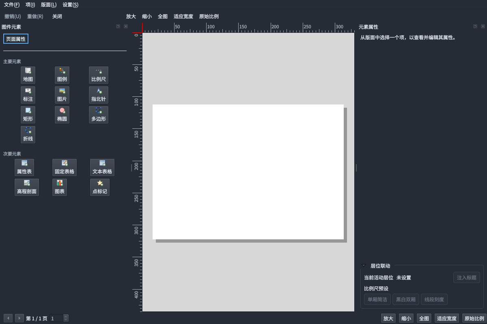
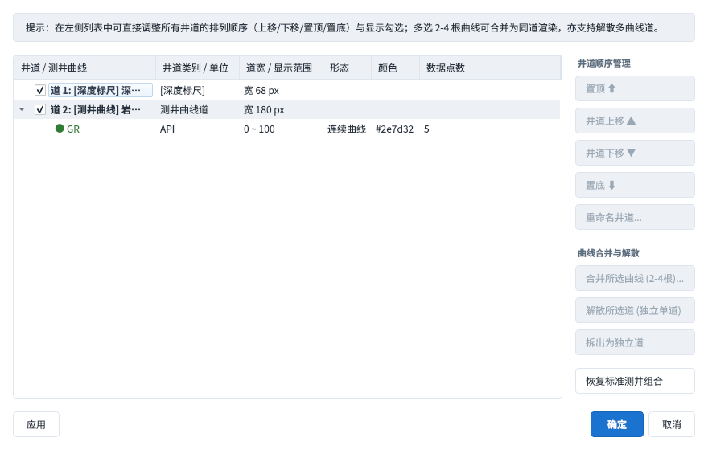

# 整体视觉统一审核与交付

日期：2026-10-02～03。分支：`codex/ui-visual-consistency`。

遵循 `DESIGN.md`，将五步工作流、数据预览和独立工具窗口的共用视觉收敛到
`PaleoTheme`。原 PR #112 已合并，本次增补基于主分支 `ede43ce`。
本轮修前证据在开始时的 `af23b54` 实际抓取，修后证据来自当前代码；
中间整合的主分支断层曲面功能不属于这次视觉变更。

## 统一规则与结果

- 共用原生控件的表面、边框、表头、普通页签、工具提示及输入状态使用同一组
  浅深主题 token；应用级样式覆盖独立窗口，主窗口在 SARibbon 模板之后使用
  同一份控件样式，避免两套默认外观。普通页签保持中性，编号工作流页签保留蓝色。
- 补齐 Fusion 的 Light/Midlight/Mid/Dark/Shadow 调色板角色，减少系统灰阶混入。
  剖面、拾取、断层、三维操作与井道导航使用同一个工具按钮样式，含悬停、
  按下、选中、禁用和键盘焦点态；普通工具按钮选中用中性描边。
- 正文与紧凑行动按钮 9pt，区块标题 12pt，辅助说明 8pt；收敛原来的 8.5pt
  辅助字号。数据预览与井道配置的主要间距使用 8／16px。地质图件自身的刻度、
  符号色及白色纸面仍遵循设计系统的文档与数据约定。
- 数值输入保留 Qt 原生增减按钮，并清掉内部文本框重复边框；样式统一不遮盖
  数值箭头。已有独立对话框在浅→深→浅切换后，输入内容与下拉选择保持不变。
- 地震剖面的长工具栏使用与主窗口相同的横向滚动容器。图件设计器初次显示后
  才执行纸面适配，避免隐藏期间缩成一点；重新打开不主动重置用户缩放。

## 本轮逐步证据

27 张修后原生 Qt/QGIS 截图均已逐张打开检查。除启动页外，每个表中步骤都有
浅深主题各一张；五页为 1440×900，独立工具保留其原生尺寸。工程、导入行和
GR 曲线为隔离的合成资料。空态与未加载态是明确的审核状态，并非加载失败。

| 步骤 | 界面 | 检查结果／健康状态 | 浅色 | 深色 |
|---|---|---|---|---|
| 0 | 启动 | 入口优先级清晰；普通按钮与表单共用边框 | [截图](ui-visual-consistency-shots/after/00-startup.png) | — |
| 1 | 数据管理 | 正常空态；列表表头与辅助标签统一 | [截图](ui-visual-consistency-shots/after/01-data-light.png) | [截图](ui-visual-consistency-shots/after/01-data-dark.png) |
| 2 | 预测编图 | 正常空态；普通页签、输入与结果表统一 | [截图](ui-visual-consistency-shots/after/02-predict-light.png) | [截图](ui-visual-consistency-shots/after/02-predict-dark.png) |
| 3 | 单因素图 | 正常空态；主操作及数值箭头可辨 | [截图](ui-visual-consistency-shots/after/03-constraint-light.png) | [截图](ui-visual-consistency-shots/after/03-constraint-dark.png) |
| 4 | 智能编图 | 正常空态；优先级按钮禁用态与结果表一致 | [截图](ui-visual-consistency-shots/after/04-compose-light.png) | [截图](ui-visual-consistency-shots/after/04-compose-dark.png) |
| 5 | 验证 | 正常未执行态；问题表与其他模块共用表头 | [截图](ui-visual-consistency-shots/after/05-validate-light.png) | [截图](ui-visual-consistency-shots/after/05-validate-dark.png) |
| 6 | 导入确认 | 正常；资料类型下拉、表头与确认按钮统一 | [截图](ui-visual-consistency-shots/after/06-import-light.png) | [截图](ui-visual-consistency-shots/after/06-import-dark.png) |
| 7 | 连井／时深设置 | 正常空井态；分组、数值控件与行动按钮统一 | [截图](ui-visual-consistency-shots/after/07-section-setup-light.png) | [截图](ui-visual-consistency-shots/after/07-section-setup-dark.png) |
| 8 | 地震剖面 | 正常未加载态；两条长命令行独立横向滚动 | [截图](ui-visual-consistency-shots/after/08-section-light.png) | [截图](ui-visual-consistency-shots/after/08-section-dark.png) |
| 9 | 断层管理 | 正常空树布局；使用共用工具按钮 | [截图](ui-visual-consistency-shots/after/09-faults-light.png) | [截图](ui-visual-consistency-shots/after/09-faults-dark.png) |
| 10 | 图件设计器 | 正常；首次显示纸面适配视口，层位区文字随主题可读 | [截图](ui-visual-consistency-shots/after/10-designer-light.png) | [截图](ui-visual-consistency-shots/after/10-designer-dark.png) |
| 11 | 单井柱状图 | 正常；操作区跟随主题，合成 GR 曲线保留纸面白底 | [截图](ui-visual-consistency-shots/after/11-well-light.png) | [截图](ui-visual-consistency-shots/after/11-well-dark.png) |
| 12 | 测井道配置 | 正常；树表、操作按钮及禁用态一致 | [截图](ui-visual-consistency-shots/after/12-curves-light.png) | [截图](ui-visual-consistency-shots/after/12-curves-dark.png) |
| 13 | 属性建模 | 正常待输入态；建模动作随主题使用 primaryText，原生数值箭头清晰 | [截图](ui-visual-consistency-shots/after/13-property-model-light.png) | [截图](ui-visual-consistency-shots/after/13-property-model-dark.png) |

## 修前问题与对应证据

1. **P2 共用控件外观分散**：五页与独立导入／时深窗口使用不同默认渐变、边框及
   表头；剖面与断层按钮分别定义不同字号及悬停蓝框。统一后色阶、边框和行动
   按钮状态一致。[预测修前](ui-visual-consistency-shots/before/02-predict-light.png)、
   [单因素修前](ui-visual-consistency-shots/before/03-constraint-dark.png)、
   [导入修前](ui-visual-consistency-shots/before/06-import-dark.png)、
   [时深修前](ui-visual-consistency-shots/before/07-section-setup-light.png)、
   [断层修前](ui-visual-consistency-shots/before/09-faults-light.png)。
2. **P2 长剖面命令行缺少独立溢出策略**：统一字号后长行需要稳定的横向滚动范围，
   保证右侧书签／删除等功能仍可到达。[修前](ui-visual-consistency-shots/before/08-section-dark.png) /
   [修后](ui-visual-consistency-shots/after/08-section-dark.png)。
3. **P2 设计器隐藏初始化缩放**：纸面缩为一点，深色下层位联动区文字也偏暗。
   初次可见后适配纸面，共用标签色解决暗色文字。[修前](ui-visual-consistency-shots/before/10-designer-dark.png)。





## 验证与复现

- 构建应用及 23 个相关测试目标成功；Qt 6.11.2、GCC 16、Ninja / RelWithDebInfo。
- CTest **31/31 通过**：主题、五页、编辑／版本、数据预览、剖面／断层、井道、
  图件设计器及分层／UI／翻译护栏；含既有对话框换主题保留输入、纸面首次适配与
  重开保留缩放的回归。
- 增量 clang-tidy：11 个改动产品翻译单元通过（本机 23.1.1，CI 使用钉定版本）。
- `git diff --check` 通过；layering、UI invariants、i18n 严格检查与自测通过。
- 既有模态测试的 3s 兜底定时器限定到本次对话框，避免误关闭下一用例的窗口。

截图复现（`QGIS_PREFIX` 为本机 vendored QGIS 安装路径）：

```bash
QT_QPA_PLATFORM=offscreen QGIS_PREFIX_PATH="$QGIS_PREFIX" \
LD_LIBRARY_PATH="$QGIS_PREFIX/lib" \
XDG_CONFIG_HOME=/tmp/paleo-visual-home/config \
XDG_DATA_HOME=/tmp/paleo-visual-home/data \
PALEO_WORKFLOW_CAPTURE=/tmp/paleo-visual-after \
PALEO_SECONDARY_CAPTURE=/tmp/paleo-visual-after \
./build/tst_ui workflowAuditSnapshots secondarySurfaceAuditSnapshots
```

## 证据边界

本轮验证共用控件的视觉及指定状态，不能据此证明所有真实资料导入、完整地质算法、
所有高级页或全部功能分支均通过人工验收。自动化回归覆盖编图／版本／编辑、
预览、剖面、断层、井道及设计器的相关契约。截图可判断文字与边界是否可见，
不能证明屏幕阅读器或完整 WCAG 合规；Windows、高 DPI 与实际 OpenGL 三维
绘制仍需相应环境验收。地质纸面和域配色保持规范中的数据语义。
